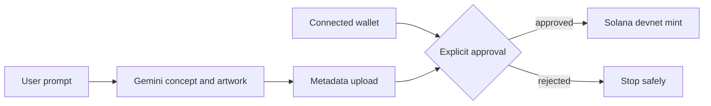

# Solana Meme Coin Factory

**Status:** experimental prototype · devnet only

A React/Vite concept generator that uses Gemini for token ideas and connects a browser wallet to create fungible tokens or NFTs on Solana devnet through Metaplex.

## Capabilities

- AI-assisted name, ticker, description, and artwork generation
- Browser-wallet connection and explicit transaction approval
- Metadata upload and token/NFT creation through Metaplex
- Progress and user-rejection error handling



## Quick start

```bash
npm install
printf 'GEMINI_API_KEY=your_key_here\n' > .env.local
npm run dev
```

`npm run build` performs the available production build check.

## Safety boundary

The interface targets devnet and still creates signed blockchain transactions. Review every wallet prompt. This repository is educational software, not financial advice, an audited token launcher, or evidence of a live deployment.

## Limitations

There is no automated test suite, security audit, liquidity workflow, or mainnet release process.
